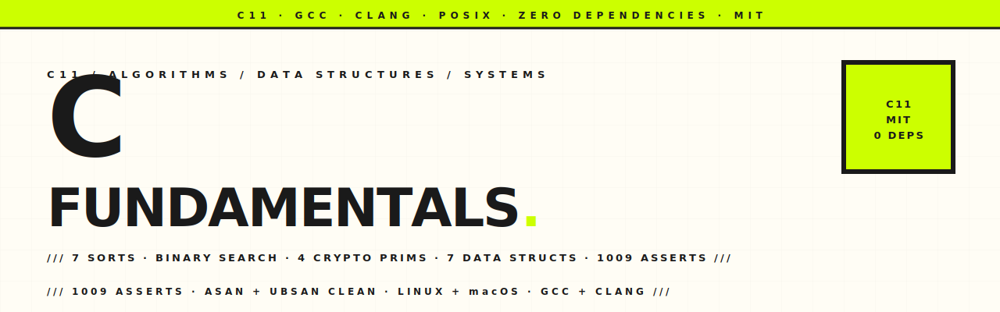

<p align="center">
  <picture>
    <source media="(prefers-color-scheme: dark)" srcset="assets/hero-banner-dark.svg" />
    
  </picture>
</p>

<p align="center">
  <a href="https://github.com/hatimhtm/c-fundamentals/actions/workflows/build.yml"></a>
  
  
  
  
  
</p>

<p align="center">
  <em>A reference implementation of the algorithms, data structures, cryptographic primitives, and systems calls every C programmer eventually writes by hand. Seven sorts, binary search, four crypto primitives (Caesar with chi-squared cracker, Vigenère, XOR, SHA-256), seven data structures (linked list, stack, queue, BST, heap / priority queue, trie, hash table), POSIX systems demos. Zero dependencies, 1009 test assertions, GCC + Clang clean on Linux + macOS, AddressSanitizer + UndefinedBehaviorSanitizer in CI.</em>
</p>

---

### `/// WHAT'S INSIDE`

| Module | Highlights |
|---|---|
| **Sorting** | Selection · Bubble · Insertion · Quicksort (Lomuto) · Merge sort (top-down with reusable aux buffer) · Heap sort (in-place) · Radix sort (LSD, byte-by-byte counting) |
| **Searching** | Binary search — iterative + recursive, size_t-safe midpoint, both `int` and string variants |
| **Encryption** | Caesar cipher with chi-squared frequency-analysis cracker · Vigenère polyalphabetic cipher · XOR stream cipher · **SHA-256 from scratch** (FIPS 180-4, validated against NIST test vectors) |
| **Data structures** | Singly-linked list · Stack (growable array) · Queue (circular buffer with O(1) push/pop) · Binary search tree · Min-heap / priority queue (with linear `heap_build`) · Trie (26-way prefix tree) · Open-addressing hash table (djb2, linear probing, tombstones, auto-resize) |
| **Systems** | Cross-platform `sysinfo` (uname, sysctl, sysconf, getloadavg, statvfs) · `signal-demo` showing graceful SIGINT/SIGTERM handling via `sigaction` + `volatile sig_atomic_t` |
| **Benchmarks** | Empirical comparison of all seven sorts on `n={100, 1k, 10k}` random integers, deterministic seed |

---

### `/// QUICK START`

```bash
git clone https://github.com/hatimhtm/c-fundamentals.git
cd c-fundamentals
make all      # 8 binaries into build/
make test     # 1009 assertions across 13 test suites
make smoke    # run every CLI once with sample input
make asan     # rebuild with AddressSanitizer + run tests
make ubsan    # rebuild with UndefinedBehaviorSanitizer + run tests
```

Compiler swap: `make clean && make all CC=clang`. Custom flags: `make CFLAGS='-O3 -march=native ...'` (the defaults already include `-Wall -Wextra -Werror -pedantic`).

---

### `/// SORTING`

```bash
./build/sorting --algo=quick zebra ant mouse cat
./build/sorting --algo=heap  apple zebra mango
echo -e "foo\nbar\nbaz" | ./build/sorting --algo=merge
```

Algorithms: `selection · insertion · bubble · quick · merge · heap · radix` (radix is integers-only, others have both `*_ints` and `*_strings`).

#### Sample benchmark output

```
| Algorithm  | n=100     | n=1000    | n=10000   |
|------------|-----------|-----------|-----------|
| Selection  |   0.01ms  |   0.58ms  |  72.73ms  |
| Bubble     |   0.02ms  |   1.59ms  | 251.43ms  |
| Insertion  |   0.00ms  |   0.41ms  |  20.51ms  |
| Quicksort  |   0.01ms  |   0.07ms  |   0.84ms  |
| Merge      |   0.04ms  |   0.08ms  |   0.82ms  |
```

Run `./build/benchmark` to regenerate; deterministic seed = 42.

---

### `/// SEARCHING`

```bash
./build/bsearch 7 3 1 9 7 4 2
# Sorted: [1, 2, 3, 4, 7, 9]
# Target: 7
# Result: found at index 4
```

Iterative + recursive variants, [tested for equivalence](tests/test_search.c) on every value 1..21 against a known sorted array.

---

### `/// ENCRYPTION`

```bash
# Caesar
./build/crypto-cli -e 3 "Hello World"            # Khoor Zruog
./build/crypto-cli -c "Khoor Zruog"              # → Guessed shift: 3 (chi-squared)

# Vigenère
./build/crypto-cli -v --key=lemon "attack at dawn"   # lxfopv ef rnhr

# XOR (encrypt = decrypt; output is hex since it may contain non-printables)
./build/crypto-cli -x --key=secret "hello"

# SHA-256
./build/crypto-cli -s "abc"
# ba7816bf8f01cfea414140de5dae2223b00361a396177a9cb410ff61f20015ad
```

The Caesar cracker uses **chi-squared distance** against standard English letter frequencies (not the naive "most-common-letter == E" approach). The SHA-256 implementation is straight from FIPS 180-4 — [validated against NIST test vectors](tests/test_sha256.c) including the empty string, "abc", and the 56-byte boundary-padding example.

---

### `/// DATA STRUCTURES`

Each structure is a self-contained library — no inter-module deps except where noted (heap sort delegates max-sift-down to `data_structures/heap`).

| Structure | API surface | Notes |
|---|---|---|
| `linked_list` | push_front/back, pop_front, find, reverse, size | Singly-linked, owns nodes |
| `cf_stack` | push, pop, peek, size, is_empty | Growable array, doubles on full (renamed from `stack` to dodge POSIX `stack_t`) |
| `queue` | enqueue, dequeue, peek, size | Circular buffer, head + size for full/empty disambiguation |
| `bst` | insert, contains, min, max, in_order traversal | Plain binary search tree (no balancing) |
| `heap` | insert, extract_min, peek_min, build_min (O(n)) | Min-heap; also exposes max-sift-down for heap sort |
| `trie` | insert, contains, starts_with | 26-way prefix tree, lowercase a-z |
| `hash_table` | set, get, remove, contains, size | Open addressing, djb2, linear probing, tombstones, auto-resize at 0.75 load |

CLI demos for `linked_list` and `hash_table`. The rest are exercised by tests:

```bash
./build/linked-list-demo 1 2 3 4 5
./build/hash-table-demo the cat sat on the mat
```

---

### `/// SYSTEMS`

```bash
./build/sysinfo -v
# OS, hostname, release, arch
# User: name / home / shell / UID / GID
# CPU info (Apple sysctlbyname or Linux sysconf)
# Memory: hw.memsize / sysconf(_SC_PHYS_PAGES)
# Load average via getloadavg()
# Disk: total / used / available / percent via statvfs()

./build/signal-demo 30
# Demonstrates graceful SIGINT/SIGTERM/SIGHUP handling via sigaction.
# Press Ctrl-C to trigger graceful shutdown.
```

`sysinfo` branches on `__APPLE__` for `sysctlbyname` (CPU brand, RAM); falls back to `sysconf` on Linux/BSD. `signal-demo` is a textbook example of the safe pattern: handler sets a `volatile sig_atomic_t` flag, main loop polls.

---

### `/// PROJECT LAYOUT`

```
c-fundamentals/
├── algorithms/
│   ├── sorting/         7 sorts + benchmark + sorts.h + main
│   ├── searching/       binary_search.c/.h + main
│   └── encryption/      caesar, vigenere, xor_cipher, sha256 + main (crypto-cli)
├── data_structures/
│   ├── linked_list/     library + demo
│   ├── stack/           library  (cf_stack_t)
│   ├── queue/           library
│   ├── bst/             library
│   ├── heap/            library  (also fuels heap sort)
│   ├── trie/            library
│   └── hash_table/      library + demo
├── systems/
│   ├── sysinfo/         POSIX + Apple sysctl
│   └── signals/         signal-demo (sigaction, sig_atomic_t)
├── tests/               13 suites, 1009 assertions, hand-rolled macros (zero deps)
├── .github/workflows/   GCC × Clang × Linux × macOS + ASan/UBSan jobs
├── assets/              hero banner SVGs
├── Makefile             8 binaries + test + smoke + asan + ubsan + install
└── README.md
```

---

### `/// TESTING`

Hand-rolled assertion macros — `tests/test.h` defines `ASSERT`, `ASSERT_EQ_INT`, `ASSERT_EQ_STR`, `ASSERT_EQ_SIZE`, `ASSERT_TRUE/FALSE`, `ASSERT_NULL/NOT_NULL`. Failures print location + message but **do not abort**, so a single `make test` run reports every failure in every suite at once.

```
$ make test
…
────────────────────
Total assertions: 1009
Failures:         0
✓ All tests passed.
```

| Suite | What it covers |
|---|---|
| `test_sorts` | 7 algorithms × 2 type variants + edge cases (empty / 1 / sorted / reversed) |
| `test_search` | Iterative · recursive · empty · missing · strings · iter-vs-recursive equivalence |
| `test_caesar` | Encrypt · decrypt · negative + large shifts · punctuation · round-trip · chi-squared crack |
| `test_vigenere` | Textbook example · case preserved · round-trip · empty key · punctuation passthrough |
| `test_xor` | Round-trip · zero-key identity · empty-key passthrough |
| `test_sha256` | NIST vectors: empty string, "abc", 56-byte boundary; hex format invariants |
| `test_linked_list` | Create · push front/back · find · reverse · pop empty |
| `test_stack` | LIFO order · peek · pop empty · resize stress to 100 elements |
| `test_queue` | FIFO order · peek · circular wraparound + resize stress |
| `test_bst` | Insert · contains · duplicate handling · min/max · in-order yields sorted |
| `test_heap` | Min-priority extraction · peek · empty cases · O(n) build_min |
| `test_trie` | Insert · contains · starts_with · rejects non-{a-z} input |
| `test_hash_table` | Create · set/get · overwrite · remove · resize-rehash · slot reuse after remove |

---

### `/// CI`

| Job | Matrix |
|---|---|
| **build** | `{ubuntu-latest, macos-latest} × {gcc, clang}` — build, run tests, run smoke |
| **sanitizers** | `ubuntu-latest × clang` — full test suite under `-fsanitize=address` then `-fsanitize=undefined`; halts on the first UB it finds |

Every push to `main` and every PR triggers all five jobs. Concurrency group cancels superseded runs.

---

### `/// CONTRIBUTING`

Pull requests welcome. The code style is K&R-ish, two-space indent, snake_case, doc comments on every public function. Please:

1. Keep `-Wall -Wextra -Werror -pedantic` clean on both GCC and Clang.
2. Add tests for new code — at minimum, one positive case + one edge case.
3. Run `make asan && make ubsan` before opening a PR.
4. Don't introduce dependencies. If you need a hash function, write it inline.

---

### `/// LICENSE`

[MIT](LICENSE) — use it, fork it, ship something with it.

---

<p align="center">
  <a href="https://hatimelhassak.is-a.dev"></a>
  <a href="https://cal.com/hatimelhassak/engineering-discovery"></a>
  <a href="https://www.linkedin.com/in/hatim-elhassak/"></a>
  <a href="mailto:hatimelhassak.official@gmail.com"></a>
</p>

<p align="center">
  <code>///&nbsp;&nbsp;OPEN FOR NEW WORK&nbsp;&nbsp;///&nbsp;&nbsp;CONTRACT &amp; FREELANCE&nbsp;&nbsp;///&nbsp;&nbsp;REMOTE WORLDWIDE&nbsp;&nbsp;///</code>
</p>
